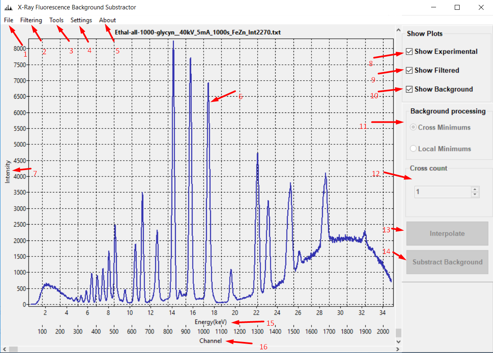
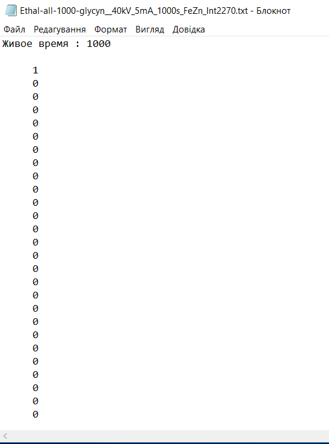
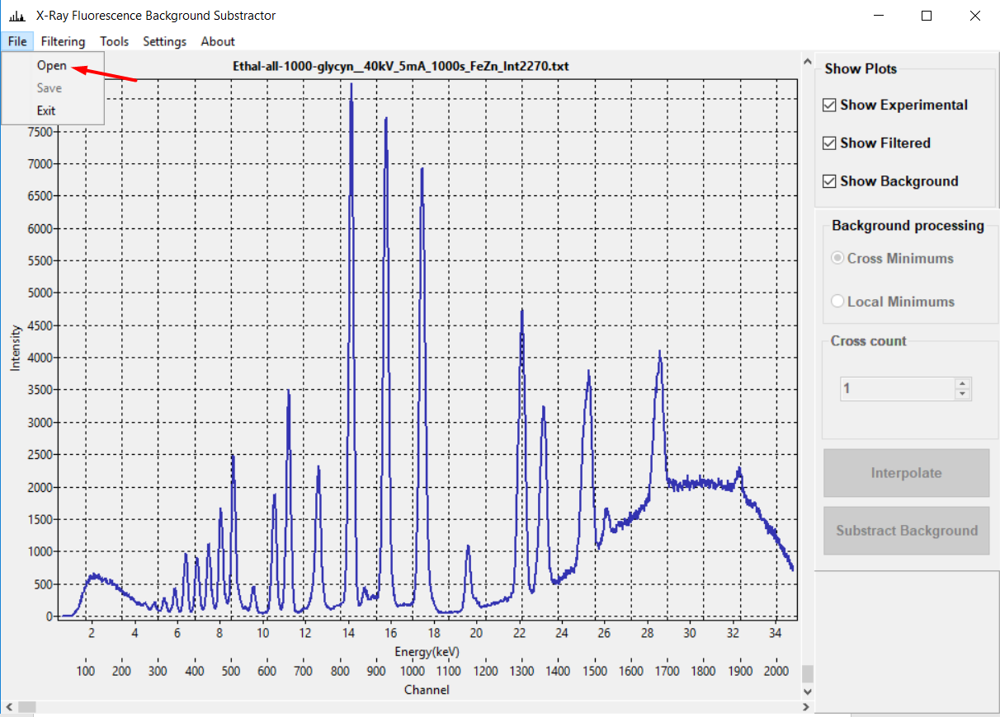
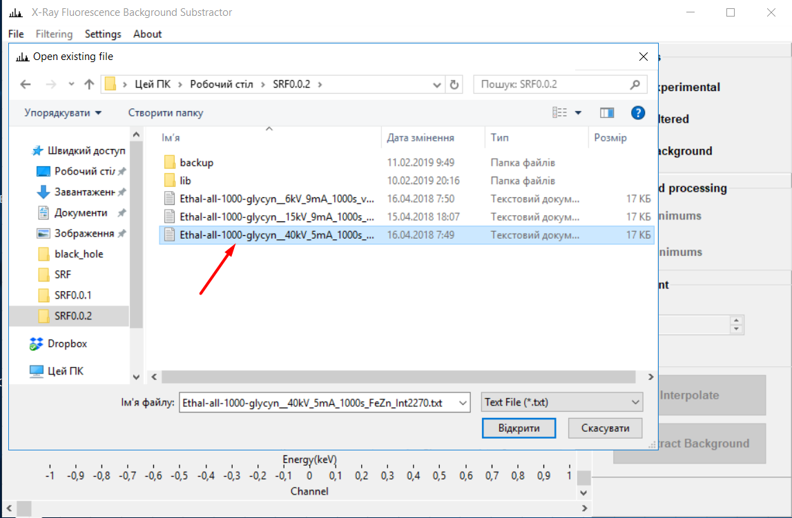
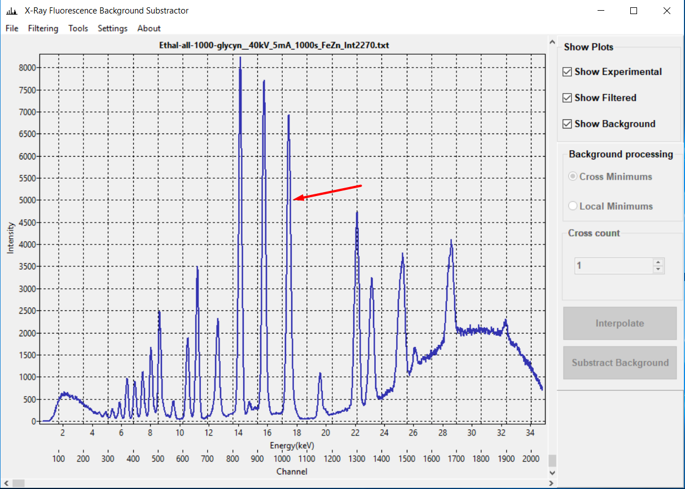

# X-Ray Background Substractor. Program uses ElvaX export files
Version 0.1.4
Cherkasy National University, Physical Department, Scientific and Educational Center Physical and Chemical researches.
Licensed by LGPL v3 licence.
For free usage.

## Program Description
X-ray Fluorescence Background Substractor uses for X-ray fluorescence spectra analysis.
The program performs the following functions:
- Description of the background line of the spectra of X-ray fluorescence;
- Subtraction of the background from the spectrum of X-ray fluorescence with the possibility
manual adjustment;
- Smoothing of experimental spectra by averaging and Savitsky-Goley filter;
- Comparative analysis of X-ray fluorescence spectra;
- Chemical elements analysis of X-ray fluorescence spectra;
- Quantitative analysis of the contents of the elements according to the standard samples;
- Ability to import third-party standart samples created by special a template.
---
The program is an third-party add-on to ElvaX 2.4 (https://elvatech.com).
The database of the spectral series of elements is formed using the open Bruker table (https://www.bruker.com).
The program supports the following operating systems: Windows XP, Windows 7, Windows 8 / 8.1, Windows 10, and Linux operating systems.
For build the program for Linux, please contact the author of the program at: andriy.gonda@gmail.com.
## Program Interface

***Picture 1.*** 1 - File menu, 2 - Filtering Menu, 3 - Tools, 4 - Settings, 5 - About Program, 6 - Workspace, 7 - Intensity Axis, 8 - Show experimental plot, 9 - Show filtered data, 10 - Show background line, 11 - Background processing control panel, 12 - Сhoice of background processing algorithm,13 - Interpolation button, 14 - Background substraction button, 15 - Energy Axis, 16 - Channel Axis.

---
### Download Spectrum Data
To work with the spectrum data, you need to download them into the program (you must first export the data from ElvaX to a text file, see the ElvaX User's Guide for more details).

***Picture 2.*** ElvaX export file format.

To download the spectrum data from the File menu, select Open. The file selection dialog opens, in which you need to select the desired file. For more details see Fig. 3 - 4.

***Picture 3.*** Selecting a File => Open.

***Picture 4.*** Selecting file.

After selecting a file, the spectrum graph should appear on the screen.
**Important!!!** *Show Experimental* must be selected to display the graph.
In Fig. 5. shows the appearance of one of variants of experimental spectra.

***Picture 5.*** Spectra example.

